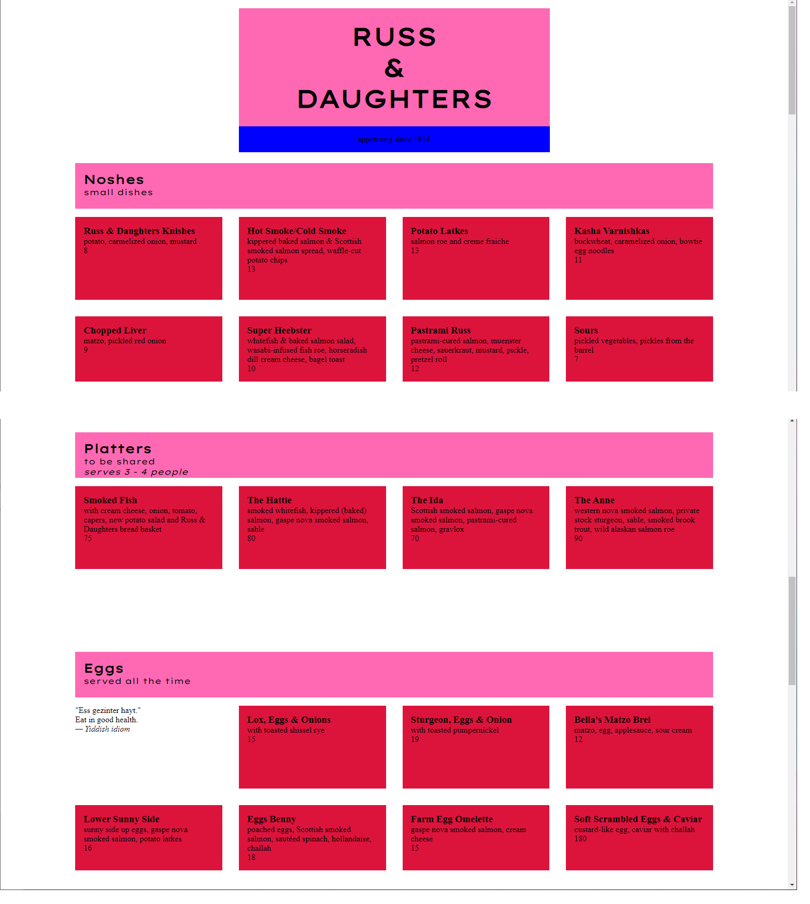
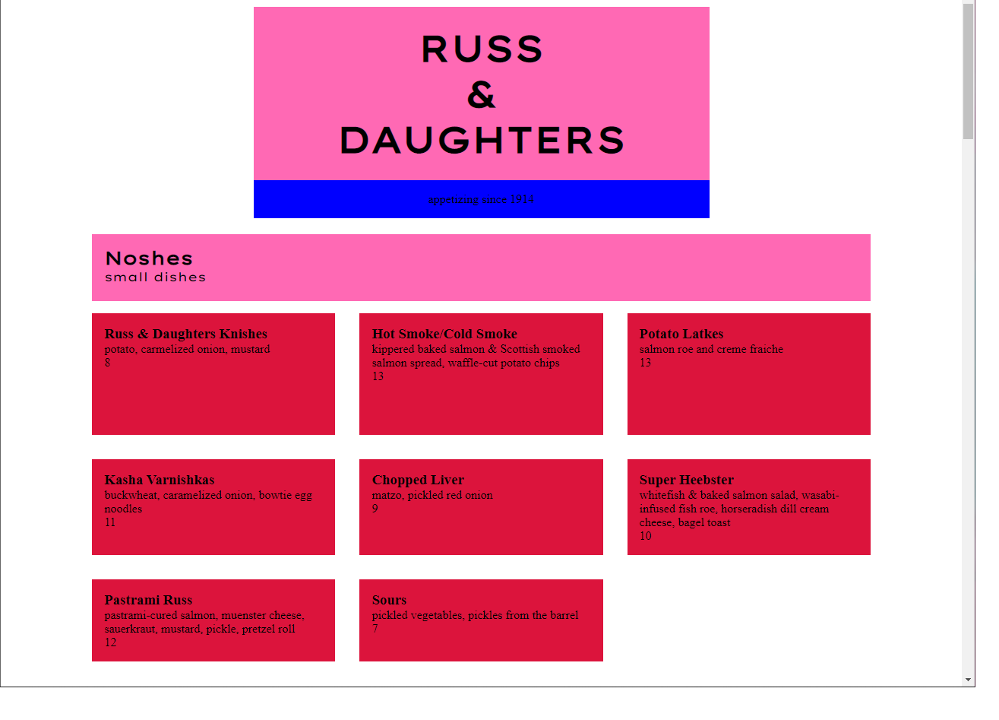
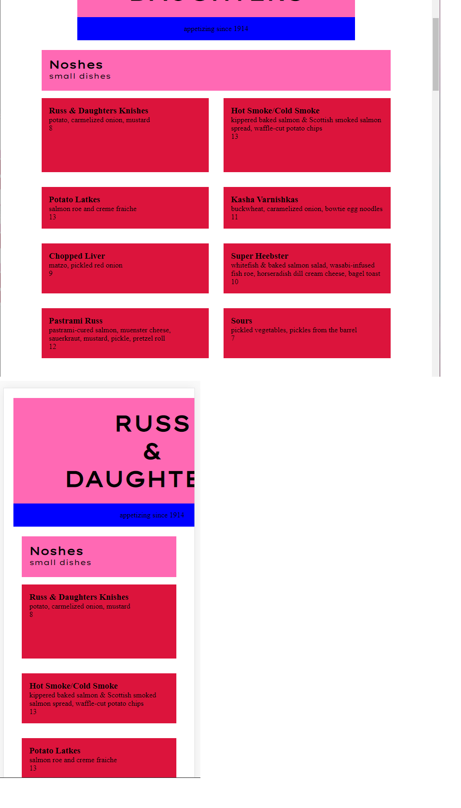
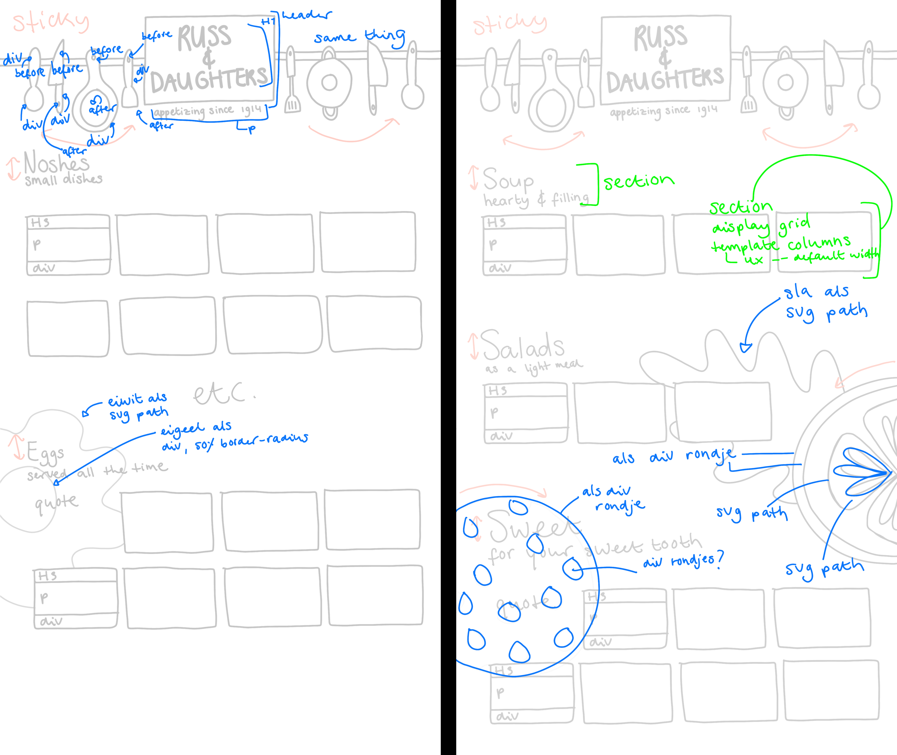

# Procesverslag Lisa Oude Elferink

<!--
## Week 4 - Afronding
Bespreek je eindresultaat. ('praatje met plaatjes').
Wat ging er soepel , wat was lastig en waar ben je trots op.
Welke experimenten heb je gedaan die die 'mislukt' zijn.
Heb je nieuwe inzichten hoe je de kracht CSS kunt benutten (of juist niet).
Waar wil je meer mee gaan doen.
-->

<!--
## Week 3 - Voortgang
Laat je voortgang zien ('praatje met plaatjes').
Wat ging er soepel en wat was lastig.
Welke experimenten heb je gedaan die die 'mislukt' zijn.
Heb je nieuwe inzichten hoe je de kracht CSS kunt benutten (of juist niet).
Neem wijzigingen aan je 1e plan op.
Waar liggen je (nieuwe) uitdagingen voor komende week.
-->

## Week 2 - Voortgang
### Dit ging goed
- Grid laten schalen zonder media queries
- Oefenen met vormpjes maken
- Oefenen met animaties
- Oefenen met SVG paths

 

### Dit was lastig
- SVG path stylen met gradient etc.

 

### 'Mislukte' experimenten
- [Eerste versie van gebakken ei](https://codepen.io/lisaoude/pen/LYbRraN)
    - Op zich prima, maar niet de vorm die ik graag wil

 

### Nieuwe inzichten
- Er kan zoooo veel met CSS qua vormen en animaties! Super leuk om mee te spelen.

 

### Nieuwe uitdagingen
- Gebakken eitje maken met SVG path
- Sla, tomaat, koekje, lepel, pan, etc. maken met puur CSS of svg path -> kijken wat werkt voor elke soort

 

### Wat er nu werkt & live staat

 

## Week 1 - Het plan
### De gekozen opdracht
Responsive restaurant menu

 

### De gekozen context
Prefers-color-scheme

 

### De twee gekozen eisen
1. Responsive zonder media queries
2. Twee kleuren
Ik ga voor zwart/wit (geen kleuren :)) met een accentkleur (nog nader te bepalen)

 

### Met welke CSS-technieken ga je als eerste aan de slag?
Ik ga als eerste aan de slag met grid om een basic lay-out te maken voor de content. Verder ga ik een beetje spelen met animaties en svg paths om zo te kijken wat ik zou kunnen toepassen in mijn ontwerp.

 

### Waar liggen mijn grootste uitdagingen 
Ik kan redelijk overweg met CSS, maar ik beheer tot nu toe vooral de basics. Mijn uitdaging is vormen maken met CSS en animeren.

 

### Schetsen van ontwerp

 

### Breakdown-schets

 